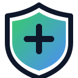

# Lite Detection Workbench

<p align="center">
  
</p>

<p align="center">
  <a href="#"></a>
  <a href="#"></a>
  <a href="#"></a>
  <a href="./LICENSE"></a>
</p>

Strategy-first detection engineering. Local-first. Export-to-JSON.

Lite Detection Workbench is a frontend-only, local-first workspace for designing detection intent before writing rules. It helps you model objectives, track feasibility and telemetry readiness, and keep the “why” and “response” context alongside your detection plans.

## What you can do

- Create detection objectives with MITRE mapping (lite)
- Capture telemetry requirements, readiness, and detailed source attributes
- Record response expectations (how to respond + who to contact)
- Add external references to support investigations and triage
- Export objectives (and the project) as JSON for sharing/review

## Export

- Per-objective JSON export: use the “Export JSON” button on an objective.
- Project JSON export: go to `Export` in the top navigation.

## Themes

Use the theme picker in the header to switch between:

- Light, Dark, Nord, Dracula, Solarized, Forest, Rose

Theme selection is saved in `localStorage`.

## Running locally

```bash
npm ci
npm run dev
```

## Acknowledgement

This project is inspired by the OpenTide detection engineering philosophy (objective-first, coverage-driven planning). It is not affiliated with OpenTide and does not include OpenTide code.

## License

MIT
